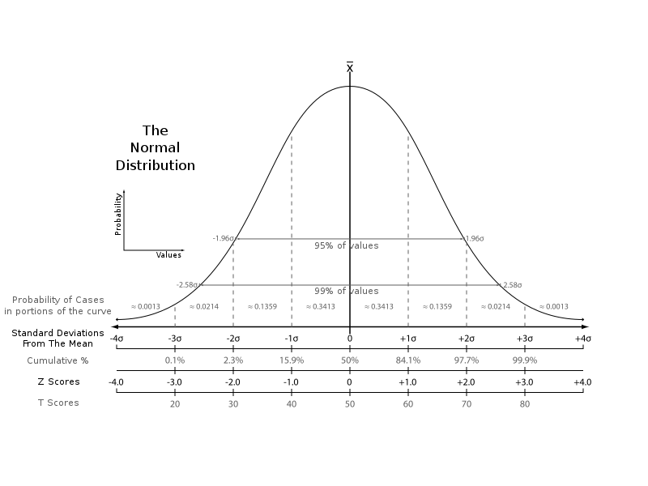
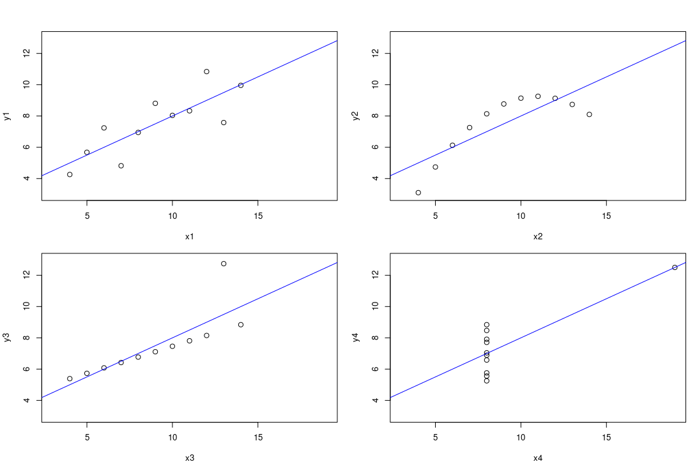

```{r setup, include=FALSE}
knitr::opts_chunk$set(echo = FALSE, message=FALSE, warning=FALSE)
```

# Two types of statistics

- **Descriptive statistics**: describing a data set
  - how the data are distributed
  - summary statistics, such as the mean or the median

- **Inferential statistics**: inferring what is happening within a *population* based on a smaller *sample* from that population 
  - all children under 1 year of age in Finland
  - 500 Finnish children surveyed to determine if they have a condition X


## Descriptive statistics
### Summary statistics

```r
summary(surveys_complete)

# Generates lots of information, including:
# Minimum and maximum values
# 1st and 3rd quartiles
# Medians and means
```

- minimum: `min()`, e.g. `min(surveys_complete$weight)`
- maximum: `maximum()` 
- minimum and maximum: `range()`
- median: `median()`
- quantiles: `quantile()`
- interquartile range, i.e. difference between the 75% and 25% ranked observations (Q3 - Q1): `IQR()`
- variance: average deviation of observations from the mean `var()`
- standard deviation: square root of variance `sd()`
- standard error = standard deviation / n (with n being the sample size)  `std.error()`


```{r, fig.align='center', fig.cap='[The normal distribution](https://commons.wikimedia.org/wiki/File:The_Normal_Distribution.svg), public domain', echo=FALSE}

```

- Note: it is not enough to only look at summary statistics!
- [Anscombe's quartet](https://en.wikipedia.org/wiki/Anscombe%27s_quartet): same mean, variance, correlation, linear regression line


```{r, out.width='95%', fig.align='center', fig.cap="Ancombe's quartet", echo=FALSE}

```

#  Inferential statistics 

## Parametric methods 

Parametric methods make assumptions about the underlying distribution of the data. A common scenario is the assumption of _normality_, i.e. adherence to the normal (or Gaussian) distribution.

```{r, echo=FALSE}
library(tidyverse)
library(ggfortify)
library(ggplot2)
```

```{r, eval=TRUE, echo=TRUE}
# generate random data from normal distribution using rnorm()
random_normal = rnorm(10000, mean = 0, sd = 1)
# creates vector with mean of 0 and standard deviation of 1

# convert to data frame
random_normal <- data.frame(random_normal)

# histogram of the data
ggplot(random_normal, aes(x = random_normal)) +
  geom_histogram(color = "black", fill = "white")
```

With real data, things practically never look as neat as they did in the example above. For example, the distributions may be *skewed* or you might see multiple peaks (or *modes*). Parametric methods are nevertheless often recommended because:

- When the assumptions are met, they are more sensitive than non-parametric analyses (you are more likely to detect an effect if there is one).
    
- If the assumptions are not met, it may be possible to address this by _transforming_ the data (e.g. using a log or _x_+1 transformation). The idea is that transfomations can help address issues including non-normality without affecting the relationship between observations (since all the data are subjected to the same transformation).

### Transforming data

The idea of transforming data is to convert the scale to in which the observations were measured into another scale. A simple example of such transformations is when temperatures measured in units of Celsius are transformer to temperatures in Fahrenheits. 

**Example**: Transform skewed data to get closer to normality using a log transformation. Each point will be replaced by log(_x_).

:::::::::::::: {.columns}
::: {.column width="50%"}

```{r, eval=TRUE, echo=TRUE}
# Create a log normal distribution
log_normal <- rlnorm(1000)

# convert to data frame
log_normal <- data.frame(log_normal)

# histogram of the data
ggplot(log_normal, aes(x = log_normal)) +
  geom_histogram(aes(y=..density..), color = "black", fill = "white") +
  geom_density(color = "red")
```

:::

::: {.column width="50%"}

```{r, eval=TRUE, echo=TRUE}
# Transform to the distribution closer to a normal distribution using log
log_norm <- rlnorm(1000)
transformed <- log10(log_norm)

# convert to data frame
transformed <- data.frame(transformed)

# histogram of the data
ggplot(transformed, aes(x = transformed)) +
  geom_histogram(aes(y=..density..), color = "black", fill = "white") +
  geom_density(color = "red")
```

:::
::::::::::::::


### Normality tests

There are several methods such as the Kolmogorov-Smirnov test and the Shapiro-Wilk test to test whether a dataset follows a normal distribution. In these tests, the null hypothesis is that the distribution is normal. If the test is significant, the distribution does not follow a normal distribution. However, it should be noted that both tests are sensitive to sample sizes.

**Shapiro-Wilk** test is a widely used test for normality of data. It can be performed by using the `shapiro.test()` function. 

_Example:_ In an experiment, 20 weird animals were collected and the lengths of their horns were measured. The researchers said to assume normality for the lengths. Is this a valid assumption?

```{r, eval=TRUE, echo=TRUE}

horn_lengths <- c(19.5, 17.1, 14.3, 17.6, 25.9, 15.3, 18.9, 21.8, 19.9, 20.4, 20.0, 17.9, 21.3, 19.5, 20.8, 23.0, 21.9, 17.1, 14.6, 14.2)

shapiro.test(horn_lengths)
```

The p-value is greater than $\alpha$ = 0.05, so we accept the null hypothesis. The researchers didn't make a mistake: they can assume that the horn lenghts are normally distributed. 

**Kolmogorov-Smirnov test** is performed by using the `ks.test(x, y, ..., alternative)` function, where _x_ is a vector of data values, _y_ specifies the distribution in question (such as `pnorm` for a normal distribution), and _alternative_ specifies the alternative hypothesis ("two.sided"/"greater"/"less"). 

_Example:_ The blood cholesterol concentration measurements of adult males are normally distributed with $\mu=200$ mg/dl and $\sigma=20$ mg/dl. In a project, 10 men were selected and their cholesterol concentrations were measured. Do the data follow the same distribution as the data from a large population of adult males? 

Measurements: 234, 229, 185, 219, 177, 221, 221, 207, 203, 155 mg/dl.

The null hypothesis states that the measured and hypothesized distributions are identical, whereas the alternative hypothesis states they differ for at least one point. 

```{r, eval=TRUE}

measurements <- c(234, 229, 185, 219, 177, 221, 221, 207, 203, 155)

ks.test(x = measurements, y = pnorm, mean = 200, sd = 20)
```

Running the test gives a warning: `ties should not be present for the Kolmogorov-Smirnov test`. This occurs because  the Kolmogorov-Smirnov test is used to test whether a sample comes from a population with a _continuous_ distribution and continuous distributions do not generate ties. 

Because the Kolmogorov-Smirnov test results in a large p-value, the null hypothesis cannot be rejected. It would be appropriate to assume that the measureded cholesterol concentrations are from a normally distributed population. 

## Linear regression

_Example:_ A study was performed on 20 medical students to investigate whether there was a relationship between vitamin C supplement intake and the knowledge about vitamin deficiency:

```{r, echo = FALSE, results='asis',  out.width='40%'}
library(knitr)
scores <- c(48,  70, 70,  71,  73,  76,  79,  82,  82,  83,  86,  86,  91,  92,  94,  96,  96,  98, 100, 100)
intake <- c(44, 48, 53, 53, 54, 56, 60, 60, 60, 60, 64, 65, 65, 66, 67, 70, 74, 74,  74, 79)

vitamins <- data.frame(intake, scores)

kable(vitamins, col.names =  c("Vitamin C intake (mg/daily)", "Knowledge score (max. 100)"))
```

Does the knowledge about vitamin deficiencies predict vitamin C intake in those students? Can knowledge about vitamin C intake cause the increase in vitamin C intake?

_Solution:_

```{r, eval=TRUE}
library(ggplot2)
ggplot(vitamins, aes(x = vitamins$scores, y = vitamins$intake)) +
 geom_point()
```

```{r, eval=TRUE, echo=TRUE}
vitamins_lm <- lm(intake ~ scores, data = vitamins)
summary(vitamins_lm)
```

The estimated model is roughly `(y = a + bx) -> vitamin C intake = 5.6 + 0.67 ∗ knowledge score`. For example, a student with a knowledge score of 80 could be predicted to have an vitamin C intake of 59.2 mg/daily. 

The R-squared value of 0.92 means that 92% of variation in vitamin C intake can be explained by the knowledge score. 
The small p-value implies that the knowledge score is significant in explaining vitamin C intake in this fictitious example. 

However, we cannot assume that any knowledge about vitamin C deficiency _causes_ the increase in vitamin C intake!

## Contingency tables


_Example:_ A study of a new drug was conducted, and the results were gathered to the following table: 

```{r, eval=TRUE}
not_cured <- c(354, 315)
cured <- c(1640, 1954)

drugtable <- cbind(not_cured, cured)
rownames(drugtable) <- c("Drug A", "Drug B")
addmargins(drugtable)

```

Does the number of cured patients depend on the type of the drug used?
Analyze the data with a contingency table.

_Solution_:
Our null hypothesis is that the drug and the number of cured patients do not depend on each other, and the alternative hypothesis is that there is a relationship between the drug and the number of cured people (one drug cures more than the other in these circumstances).

First, let's check that all expected values are greater than 5: 

```{r, eval=TRUE, echo=TRUE}
chisq.test(drugtable)$expected
```

Then we can perform a chi-squared test:

```{r, eval=TRUE, echo=TRUE}

chisq.test(drugtable) 
```

The resulting p-value is small, and we can reject then null hypothesis. 

## Simple exercises for discussions, quizzes or polls

_Example_: Suggest a null hypothesis and an alternative hypothesis for whether more than 70% of patients suffer from a heart condition in a controlled study.

- Answer: Let $\theta$ be the probability of people having a heart condition. The null hypothesis is $H0: \theta>= 0.70$ and the alternative hypothesis is $H1: \theta < 0.70$.


_Example_: In total 200 employees were investigated to study whether having an additional coffee break was effective in preventing job related stress during a month of measurement time. 
Out of those employees, 100 were granted with an extra coffee break every day for a month. The other 100 employees were randomized to a group who did get an extra coffee break during the same time period. What would be the correct statistical test to test whether there is a statistical relationship between having an additional coffee break and job related stress? 

_Example_: There are two new alternatives, drug A and B, to treat a disease. To evaluate the effectiveness of these drugs, patients were randomized to receive either drug A or drug B. Out of 10 patients receiving drug A, 7 were cured and 3 were not. Out of 10 patients receiving drug B, 5 were cured and 5 were not. What kind of statistical test would you use to test the null hypothesis: the drugs are equally effective? 
